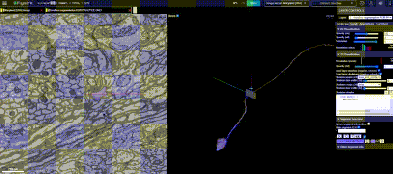
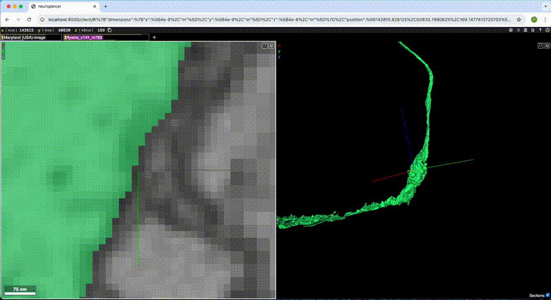
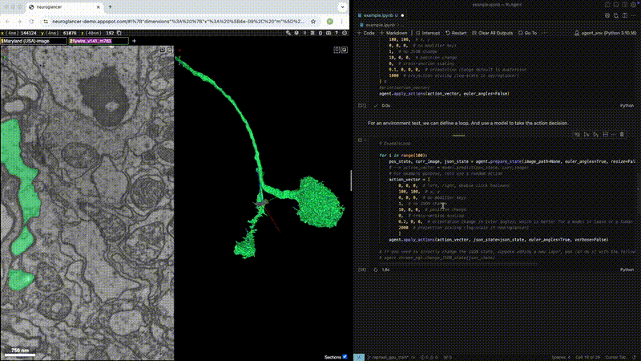

# Neuroglancer Benchmark for Automated Proofreading

The pipeline to obtain full connectomes (brain wirings) is steadily being fully automated, from the images obtained by electron microscopy, segmentation models then build 3D models of the neurons. However, even with superhuman precision from the models, some reconstructed neurons bear errors. 

Currently, a team of human proofreaders are manually finding these errors and correcting them through a Web Interface called **Neuroglancer**.

This is **unscalable**. We need **Agents** capable of making human-level decisions and applying them through the Web interface onto the neurons to help our teams. The Neuroglancer environment is a challenging one. While the overall goal is fully automated proofreading, we could imagine several intermediate challenges that could lead to it. (navigating efficiently neurons, finding errors, finding synapses…).

## Understanding the Setup

- **[Flywire Environment Tutorial](https://ngl.flywire.ai/)**: Provides access to neurons in a Neuroglancer-like environment, including a proofreading tutorial. This gives access to the neuron reconstruction of the female fly brain.

## Example Videos  

### 1. Human Proofreader in Action  
Example of a human proofreader making a sequence of actions. He detects an **abnormal cut**, explores the nearby environment and corrects the error.  
  

### 2. Model Clicking on the Highest Z Position  
Example of a trained model clicks on the **highest Z position** (blue axis) of a neuron within its field of view. The action space is limited to clicking only. Future improvements could incorporate **zooming out and changing orientation** for faster navigation. Manipulating a 3D environment is a difficult task and is one of the main challenges in automated proofreading.
  

### 3. Programmatic Use of Neuroglancer  
Existing code for **Neuroglancer integration with Python**, showing how the environment can be used in **reinforcement learning (RL)** setups to return images, states, and execute direct actions. The code  was built for fast querying by writing direct Javascript commands with Selenium.
  
